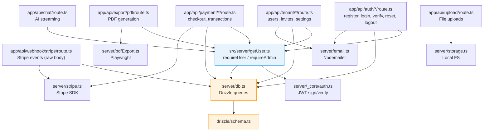
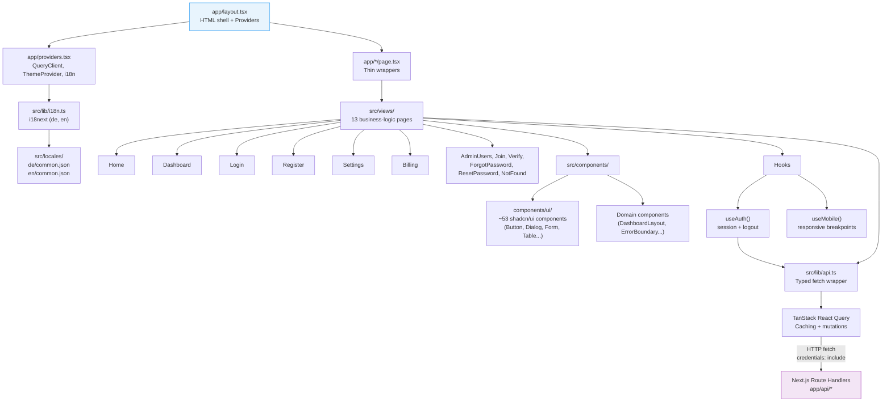
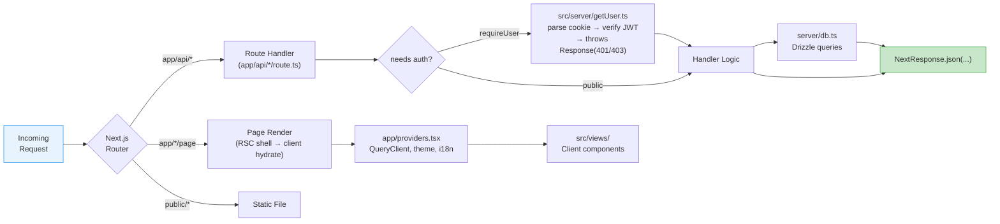
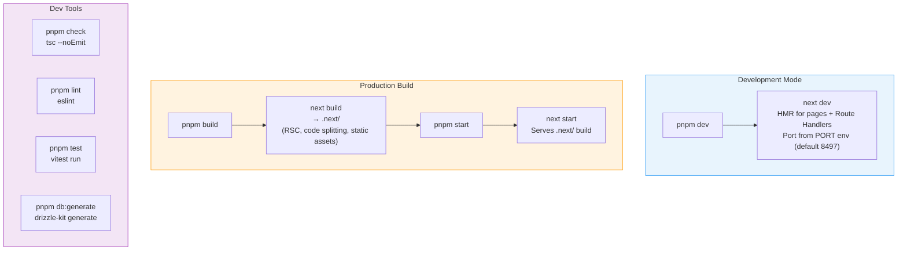
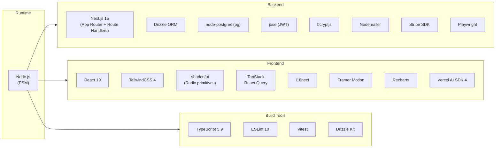

```mermaid
graph TD
    API["/api"]

    API --> Health["/health<br/>GET — status check"]

    API --> Auth["/auth"]
    Auth --> AuthMe["GET /me"]
    Auth --> AuthReg["POST /register"]
    Auth --> AuthLogin["POST /login"]
    Auth --> AuthLogout["POST /logout"]
    Auth --> AuthVerify["POST /verify-email"]
    Auth --> AuthJoin["POST /join"]
    Auth --> AuthForgot["POST /forgot-password"]
    Auth --> AuthReset["POST /reset-password"]
    Auth --> AuthLang["POST /language 🔒"]
    Auth --> AuthDel["DELETE /account 🔒"]

    API --> Tenant["/tenant"]
    Tenant --> TSettings["GET /settings 🔒"]
    Tenant --> TName["PUT /name 🛡️"]
    Tenant --> TUsers["GET /users 🛡️"]
    Tenant --> TInvite["POST /invite 🛡️"]
    Tenant --> TInvites["GET /invites 🛡️"]
    Tenant --> TInvDel["DELETE /invites/:id 🛡️"]
    Tenant --> TInvResend["POST /invites/:id/resend 🛡️"]
    Tenant --> TUserRole["PUT /users/:userId/role 🛡️"]
    Tenant --> TUserDel["DELETE /users/:userId 🛡️"]
    Tenant --> TDel["DELETE / 🛡️"]

    API --> Payment["/payment"]
    Payment --> PCheckout["POST /checkout 🔒"]
    Payment --> PTx["GET /transactions 🔒"]

    API --> Export["/export"]
    Export --> EPDF["POST /pdf 🔒"]

    API --> UploadEP["/upload<br/>POST — file upload"]
    API --> Webhook["/webhook/stripe<br/>POST — Stripe events"]
```

# Development (Implementation) Architecture View

This document describes the code organization, module structure, technology stack, and build pipeline.

---

## Project Structure

Top-level directory layout and the role of each package.

```mermaid
graph TD
    Root["/ (project root)"]

    Root --> App["app/<br/>Next.js App Router"]
    Root --> Src["src/<br/>Client components + helpers"]
    Root --> Server["server/<br/>Business logic"]
    Root --> Shared["shared/<br/>Shared types + config"]
    Root --> Drizzle["drizzle/<br/>DB schema"]
    Root --> Public["public/<br/>Static assets"]
    Root --> Data["pg-data/<br/>PostgreSQL data"]
    Root --> Uploads["uploads/<br/>File storage"]
    Root --> Docs["docs/<br/>Documentation"]
    Root --> NextOut[".next/<br/>Production build"]

    App --> ALayout["layout.tsx — HTML shell"]
    App --> AProviders["providers.tsx — QueryClient, theme"]
    App --> APages["*/page.tsx — thin wrappers"]
    App --> AAPI["api/*/route.ts — Route Handlers"]

    Src --> SViews["views/ — 13 route pages"]
    Src --> SComp["components/ — UI + domain"]
    Src --> SCompUI["components/ui/ — shadcn/ui"]
    Src --> SHooks["hooks/ — useMobile, usePersistFn"]
    Src --> SCoreHooks["_core/hooks/ — useAuth"]
    Src --> SLib["lib/ — api.ts, basePath.ts, i18n.ts"]
    Src --> SLocales["locales/ — de/, en/"]
    Src --> SCtx["contexts/ — ThemeContext"]
    Src --> SServer["server/getUser.ts — auth helpers"]

    Server --> SCore["_core/ — auth.ts, env.ts, cookies.ts"]
    Server --> SUtils["utils/ — logger.ts"]
    Server --> SServices["db.ts, email.ts, stripe.ts,<br/>storage.ts, pdfExport.ts"]

    Drizzle --> Schema["schema.ts — 4 tables"]

    Shared --> Types["config.ts, const.ts"]
```

---

## Server Module Architecture

How server modules depend on each other, from Route Handler to database.

---

## Client Module Architecture

How the Next.js frontend is structured from layout down to the API layer.

---

## Request Handling Pipeline

How Next.js processes each incoming request.

---

## Build Pipeline

Development vs. production build processes.

---

## Technology Stack

---

## API Route Map

All REST endpoints, each implemented as a Route Handler in `app/api/`.

> 🔒 = `requireUser` &nbsp;&nbsp; 🛡️ = `requireAdmin`
