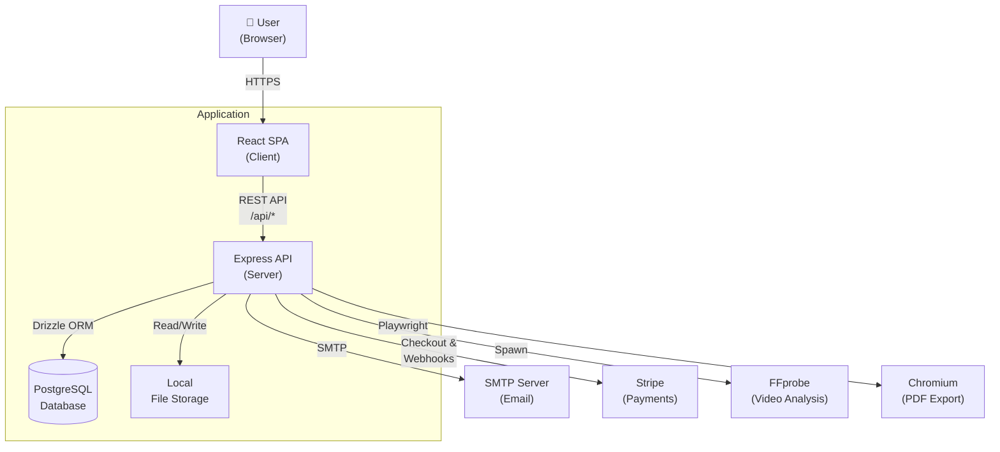
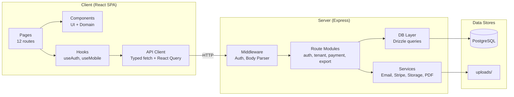
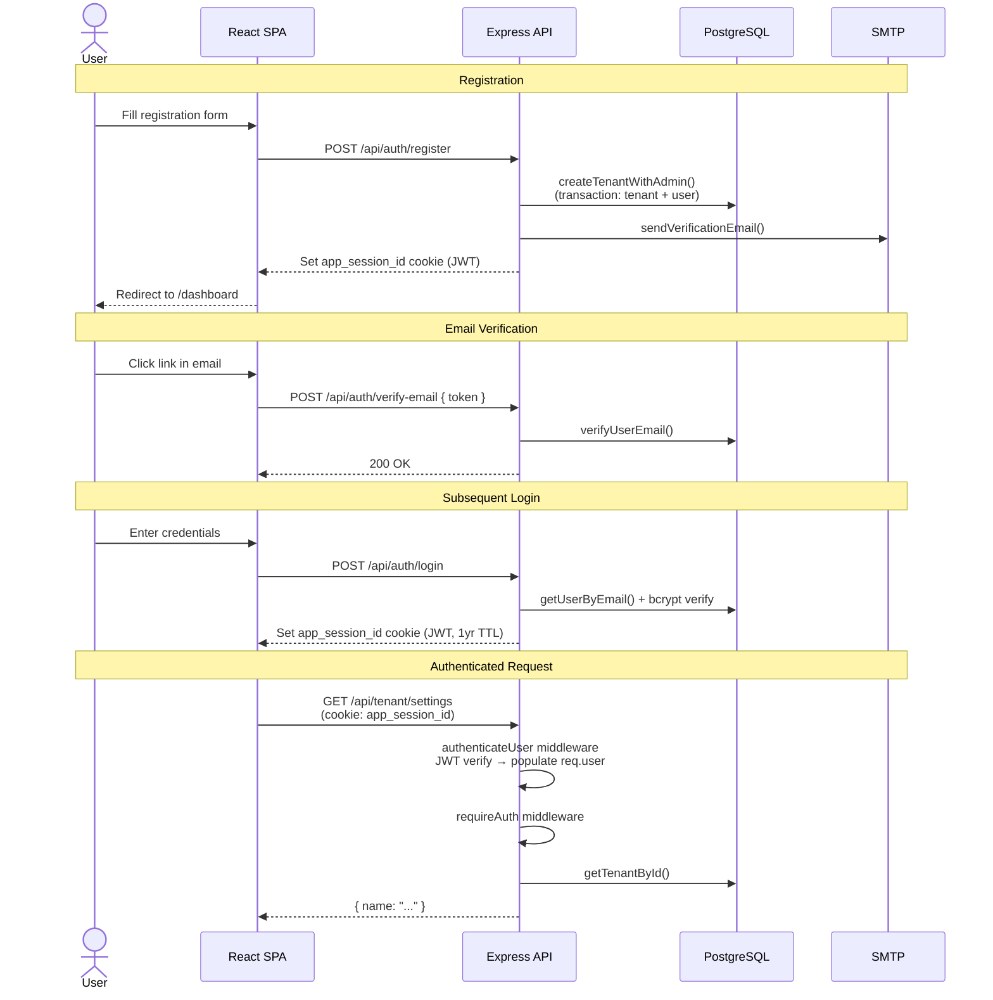
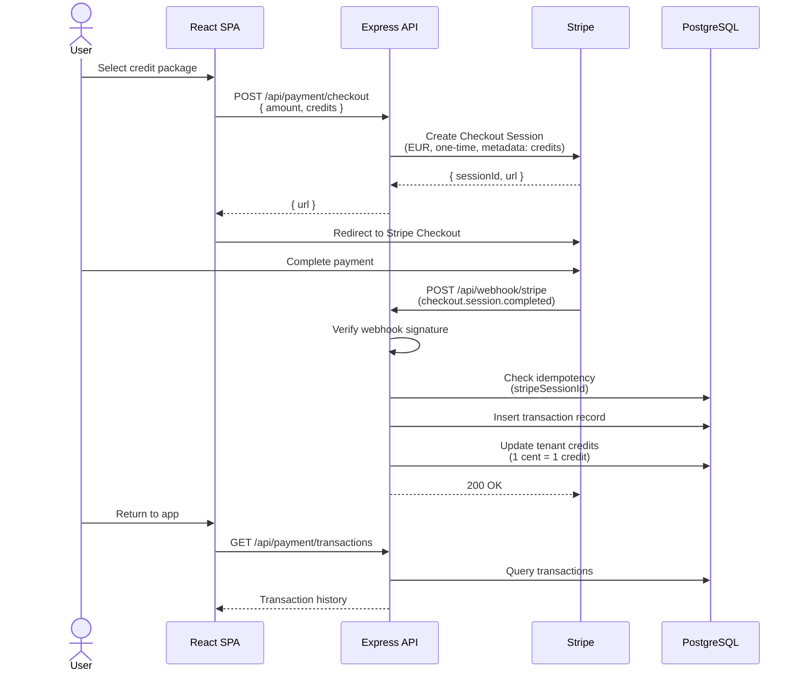
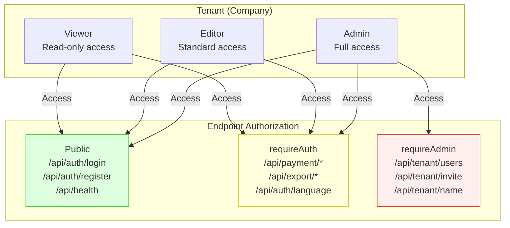
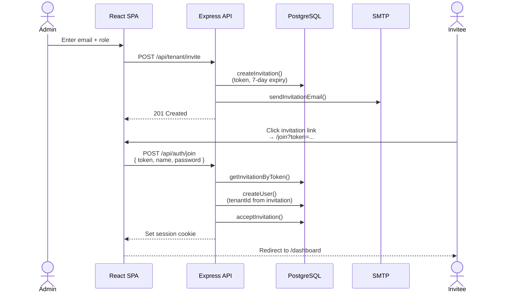

# Logical Architecture View

This document describes the system from a functional perspective — its key abstractions, external dependencies, and how they interact at runtime.

---

## System Context

Shows the application boundary, its users, and the external systems it integrates with.

---

## Component Overview

The major logical components and their responsibilities.

---

## Authentication Flow

How a user registers, logs in, and makes authenticated requests.

---

## Payment Flow

How credits are purchased via Stripe Checkout.

---

## Multi-Tenant Authorization Model

How roles and tenant isolation work.

---

## Invitation Flow

How users are invited to join a tenant.

